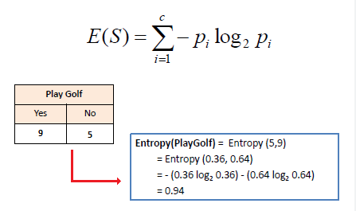

## Decision Tree Classifier

On the above dataset we will try to find out the mathematical intution of decision tree classifier.

The above dataset is a classification problem, based on the various independent features like outlook, temperature, humidity, wind we have to predict dependent feature whether we are able to play tennis or not.

Decision tree is basically a tree like structure which classifies the data based on certain conditions and it follows the parent-child relationship.

- Like the top node from which the tree starts is called root/parent node
- the below nodes from root/parent are called as child nodes
- the end node where the tree stops branching after child nodes are called as leaf nodes.

Now let's see the classification of tree based on first outlook feature of the above dataset.

So w.r.t outlook what is the count of categories in dependent feature.
like how many yes and how many no in play feature.

outlook --> 9Y & 4N

Now inside the outlook feature there are 3 splits as in there are 3 categories
now again find out how many yes & no in play feature w.r.t these 3 categories

1) Sunny --> 2Y & 3N
2) Rainy --> 3Y & 1N
3) Overcast --> 4Y & 0N

Now as here we have selected outlook feature, but we have 3 more such features so which one to choose for root node is the question.

So we will select the features based on the purity of split.

**What does mean by purity of split?**
so in the above example we have seen that,
- Overcast feature has 4Y & 0N so it means it's a pure split, now we cannot further split this feature, so this type of node is also called as leaf node.

So now the question comes how to find the purity of the feature.

### **The purity of feature is calculated on the following two methods**

**1) Entropy** :- The formula for entropy is given as,

more simplified formula for both positive class -> p and negative class -> q is given as,

As the categories in the features increases, our formula also increases as it add the further categories terms.

Now if we take the above example of outlook feature and in the outlook if we take sunny category, and try to find the entropy for sunny category 

Entropy (sunny) = -p(y) * log 2(y) - p(n) * log 2(n)
Entropy (sunny) = -2/5 * (log 2(2/5) - 3/5 * log2(3/5)
Entropy (sunny) =  -2/5 *(log2(2) - log2(5)) - 3/5 * (log2(3) - log2(5))
Entropy (sunny) = -2/5 * (-1.32) -3/5 * (-0.74)
Entropy (sunny) = 0.528 + 0.444
Entropy (sunny) = 0.972

Similarly, we can calculate the entropy for other categories of outlook feature i.e. rainy & overcast.

Entropy (rainy) = -p(y) * log 2(y) - p(n) * log 2(n)
Entropy (rainy) = -3/4 * (log2(3/4)) - 1/4 * (log2(1/4))
Entropy (rainy) = -3/4 * (-0.416) -1/4 * (0)
Entropy (rainy) = 0.312 + 0
Entropy (rainy) = 0.312

Entropy (overcast) = -4/4 * (log2(4/4)) - 0/4 * (log2(0/4))
Entropy (overcast) = -4/4 * (0) - 0
Entropy (overcast) = 0

Hence for the perfect pure split (either of any +ve or -ve should be 0) we get entropy = 0, and for perfect impure split (both +ve & -ve class are same) we get entropy = 1

**2) Gini Impurity** :- The formula for Gini Impurity is given as,

Now we will find the gini impurity for same above 3 categories of outlook feature.

1) Sunny = 2Y & 3N
2) Rainy = 3Y & 1N
3) Overcast = 4Y & 0N

G.I. (sunny) = 1 - sum(pi)^2
G.I. (sunny) = 1 - [(2/5)^2 + (3/5)^2]
G.I. (sunny) = 1 - (0.16 + 0.36)
G.I. (sunny) = 0.48

G.I. (rainy) =  1 - [(3/4)^2 + (1/4)^2]
G.I. (rainy) = 1 - (0.5625 + 0.0625)
G.I. (rainy) = 0.375

G.I. (overcast) = 1 - [(4/4)^2 + (0/4)^2]
G.I. (overcast) = 1 - (1+0)
G.I. (overcast) = 0

The comparison graph for entropy vs gini impurity for the probability values of +ve and -ve categories of the feature is given as,

Hence we can say that, 
the range for entropy = [0, 1]
the range for gini impurity = [0, 0.5]

Now by calculating entropy and gini impurity we are finding the purity of that particular feature, but to go one step ahead if we have more than one feature and want to choose which feature first we choose as a root node.
Then we have to find out the **Information gain for that feature**

**Inside the decision tree classifier we have two types of algorithms,** 

1) ID3 :- Iterative Decotomiser
2) CART :- Classification & Regres  sion Tree

1) ID3 :- In general if we use ID3 algorithm, then we use **entropy and Information gain** in this algorithm to select the root node of the tree

2) CART :- In CART we use **Gini impurity and Information gain** to select the root node of the tree

### **Information Gain**

The main point to use information gain is to use the maximum information from the feature and split the data based on that maximum information giving feature.

Now let's find out the information gain for the above example,

1) ID3 :- Which uses Information gain with the entropy formula

The formula for information gain is given as,

Where,
Entropy(S) = Entropy of the root feature
Sv = The total samples for the each split after root node i.e child node
S = Total no of samples for the root feature
Entropy(Sv) = Entropy for each split node

IG(outlook) = Entropy(outlook) - sum [(S(sunny)/S * Entropy(sunny) + S(rainy)/S * Entropy(rainy) + S(overcast)/S * Entropy(overcast))]

Entropy(outlook) = -9/13 * log2(9/13) - 4/13 * log2(4/13)
Entropy(outlook) = 0.6923 * (-0.54) - 0.3076 * (-1.7)
Entropy(outlook) = 0.3738 + 0.52292
Entropy(outlook) = 0.8967

IG(outlook) = 0.8967 - sum(5/14 * 0.972 + 4/14 * 0.312 + 4/14 * 0)
IG(outlook) = 0.8967 - (0.3471 + 0.0891 + 0)
IG(outlook) = 0.4605

**We will select the feature for which the information gain is maximum so that it will provide the maximum information**

2) CART :- Which uses Information gain with the Gini impurity formula

