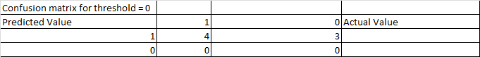
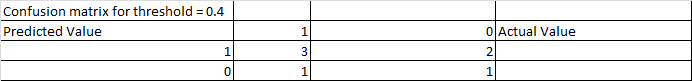
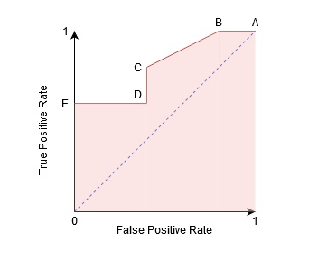
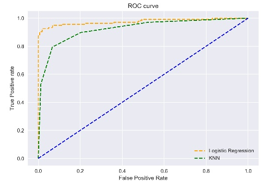

## ROC And AUC Curve

ROC AUC Curve mainly used in logistic regression to select the threshold value for classification problems.
Whether to select 0.5 as threshold so that y > 0.5 means +ve class & y <= 0.5 means -ve class.

### **AUC**

Now if we want to understand the concept of ROC AUC curve we will try to draw the curve manually by selecting different threshold values.

**Case 1:- Threshold = 0**

Let's say we have actual value & predicted value.

Now if we select the threshold = 0, then all the predicted value > 0 will be classified as 1 (+ve class)
& all the predicted values <= 0 will be classified as 0 (-ve class).

Now for this we will find the True Positive Rate (TPR) & False Positive Rate (FPR)

If threshold is 1 almost all the predicted values will be classified as 1, hence the confusion matrix would be,

TPR = TP / TP + FN
TPR = 4 / 4 + 0
TPR = 1

FPR = FP / FP + TN
FPR = 3 / 3 + 0
FPR = 1

Threshold(0) = (1,1)

**Case 2:- Threshold = 0.2**

The confusion matrix for this threshold would be,

TPR = TP / TP + FN
TPR = 4 / 4 + 0
TPR = 1

FPR = FP / FP + TN
FPR = 2 / 2 + 1
FPR = 0.66

Threshold(0.2) = (1,0.6)

**Case 3:- Threshold = 0.4**

The confusion matrix for this threshold would be,

TPR = TP / TP + FN
TPR = 1 / 1 + 3
TPR = 0.25

FPR = FP / FP + TN
FPR = 2 / 2 + 1
FPR = 0.66

Threshold(0.4) = (0.25, 0.6)

Now similarly if we keep on doing like this we will get some more points for various threshold values.

Now we will plot this points on graph for x-axis = FPR & for y-axis = TPR
we will get the area chart from line joining the points

Now this pink area under the curve is called AUC Curve.
We will always consider the threshold points above the center line of AUC.

### **Now the question comes, which threshold value needs to be selected?**

**It will depend on whether we have to keep the TPR max and FPR min or Both TPR & FPR min**
In the above image if we want to keep TPR high but FPR min then point B threshould would be selected.

### **ROC Curve (receiver operating characteristic curve)**

In the above image if we join all the threshold points starting from origin (0, 0) to (1, 1)
then we will get the ROC curve.

And the area under ROC curve is called as AUC.

**If AUC is able to capture the maximum area then our model is performing well**

