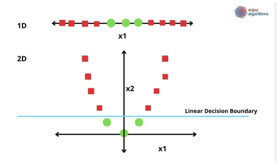
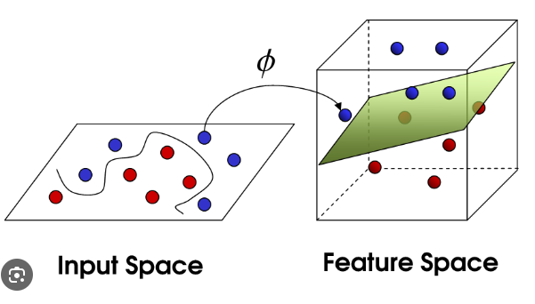
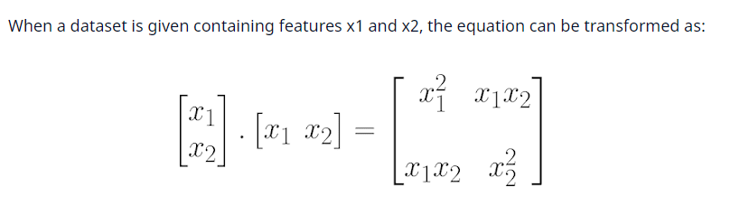
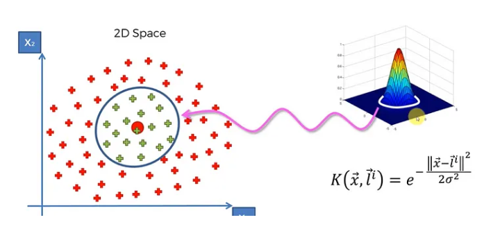

## Support Vector Machine Kernels

In the SVC we saw to solve the linearly seperable data, i.e. by drawing marginal planes and a best fit line we are able to solve the classification problem

This linearly seperable data in SVC are called as Linear SVC and this Linear is called as Kernel.

**Why SVM kernels are used?**

The SVM kernels are used to apply some transformational techniques (mathematical formula) for increasing the dimensions of the data.

exa:
Let's take an example that we have the data points of two class in 1-D i.e y = 0 for all points.

- Now y = 0 means all the data points will be on x-axis only and if we have mixmatched data for the two classes
- like 1st point from class 1, 2nd from class 2, again 3rd from class 1, and 4th from class 2 then we cannot draw a best fit line.
- so for this type of 1-D problems we have to transform this into 2-D to able to draw best fit line
- one type of 2-D transformation is using parabola eqn i.e. y = x^2.

- Now after applying transformation, we can clearly apply Linear SVC.

### **Types of Kernels**

1) Polynomial Kernel
2) RBF kernel
3) Sigmoid Kernel

1) Polynomial Kernel:- 

Let's suppose if we have non-linear seperable 2-D data, and we have to classifiy the data then first we must have to transform the data into 3-D then only it will be able to classify.

Formula for Polynomial kernel is given by,

f(x1, x2) = (x1^T * x2 + c)^d

where,
x1 & x2 are the two co-ordinates in 2-D plane for a point.
d = the dimensions in which we need to transform
c = constant

In 2-D we have two variables, x1 & x2 and by taking dot product of x1^T & x2 it will become,

Now if we take only the unique elements from the above matrix we will get 
x1, x2, x1*x2, x1^2, x2^2 wherein x1 & x2 are the already elements from the 2-D.
The new terms are added in 3-D which are x1*x2, x1^2, x2^2

2) RBF kernel (Radial Basis Function
)

In this image the center part in 2-D plane is pulled up in the 3-D plane by the given equation, and after pulling that data points we are linearly seperable data.

